# Vault MCP

MCP server for credential isolation in LLM agents. Your bot uses passwords and API keys — but never sees them in its context window.

## The Problem

When an AI agent needs to log into a website or call an API, the typical flow leaks credentials:

```mermaid
flowchart LR
    User["👤 User"] -->|"password in chat"| LLM["🧠 LLM"]
    LLM -->|password in context| Site["🌍 Website"]
    style LLM fill:#f85149,color:#fff
```



**The password is in the LLM's context window** — stored in conversation history, potentially logged, visible in session exports.

## The Solution

Vault MCP adds an encrypted layer between the agent and credentials:

```mermaid
flowchart LR
    User["👤 User"] -->|"password via browser form"| Vault["🔒 Vault"]
    Vault -->|"encrypted storage"| Store["🗄️ AES-256-GCM"]
    LLM["🧠 LLM"] -->|"vault_login('jira')"| Vault
    Vault -->|"fills form via CDP"| Site["🌍 Website"]
    Vault -->|"status: success"| LLM
    style Vault fill:#3fb950,color:#fff
    style LLM fill:#58a6ff,color:#fff
```



**The LLM never sees the password.** It only sends commands (`vault_login`) and receives status (`success`).

## How It Works

### Adding a Credential

When the agent needs credentials it doesn't have, it calls `vault_add()`. A browser form opens — the password goes directly to the encrypted store, bypassing the LLM entirely:

```mermaid
sequenceDiagram
    participant User as 👤 User
    participant LLM as 🧠 LLM
    participant Vault as 🔒 Vault MCP
    participant Browser as 🌐 Browser (localhost)
    participant Store as 🗄️ Encrypted Store

    User->>LLM: "Log me into Jira"
    LLM->>Vault: vault_add({ site_id: "jira" })
    Vault->>Browser: Opens localhost:9900/add?site=jira
    Note over Browser: User sees a form with<br/>password field masked ●●●●
    User->>Browser: Fills email + password
    Browser->>Store: AES-256-GCM encrypt → save
    Store-->>Vault: ✅ Credential saved
    Vault-->>LLM: { status: "success", site_id: "jira" }
    Note over LLM: Password was NEVER<br/>in the LLM context
```



### Using a Credential

When the agent calls `vault_login()`, Vault decrypts the password internally and fills the browser form via Chrome DevTools Protocol:

```mermaid
sequenceDiagram
    participant LLM as 🧠 LLM
    participant Vault as 🔒 Vault MCP
    participant Store as 🗄️ Encrypted Store
    participant Chrome as 🖥️ Chrome (CDP)
    participant Site as 🌍 Jira

    LLM->>Vault: vault_login({ site_id: "jira" })
    Vault->>Store: Decrypt credential
    Store-->>Vault: { email, password }
    Vault->>Chrome: Fill email field
    Vault->>Chrome: Fill password field
    Vault->>Chrome: Click submit
    Chrome->>Site: POST login form
    Site-->>Chrome: ✅ Dashboard loaded
    Vault->>Chrome: Clear password from DOM
    Vault-->>LLM: { status: "success", page_title: "Jira Dashboard" }
    Note over LLM: Got only the status.<br/>Password stayed inside<br/>the Vault process.
```



### API Requests

For API keys, `vault_api_request()` injects the key into headers automatically:


## Quickstart

```bash
# 1. Clone and build
git clone https://github.com/Chill-AI-Space/vault-mcp.git
cd vault-mcp
npm install
npm run build

# 2. Register with Claude Code
claude mcp add -s user vault -- node ~/path/to/vault-mcp/dist/index.js

# 3. Use in Claude Code session
# "Log me into GitHub" →
#   Claude calls vault_add("github") → browser form opens → you enter password
#   Claude calls vault_login("github") → Chrome logs in
#   Claude sees only { status: "success" }
```

You can also add credentials via CLI (outside of Claude Code):

```bash
node dist/index.js add --site github --email you@example.com --url https://github.com/login
# Password is prompted interactively (masked)
```

## MCP Tools

| Tool | Description |
|------|-------------|
| `vault_add(site_id?, service_type?)` | **Securely add credential.** Opens browser form — password never touches LLM. |
| `vault_login(site_id)` | Log into a website via Chrome CDP. Returns only status. |
| `vault_api_request(service, url, ...)` | Make API request with stored credentials injected. |
| `vault_list()` | List all credentials (no secrets shown). |
| `vault_status(site_id)` | Check credential status, last used, audit count. |

## CLI Commands

```bash
vault-mcp add                        # Interactive: add credential
vault-mcp add --site X --email Y     # Semi-interactive (password prompted)
vault-mcp list                       # List credentials (no secrets)
vault-mcp remove <site_id>           # Remove credential
vault-mcp audit [site_id]            # View audit log
vault-mcp dashboard                  # Web UI on localhost:9900
vault-mcp serve                      # Start MCP server (stdio, for debugging)
```

## Architecture


## Configuration

| Env Variable | Default | Description |
|-------------|---------|-------------|
| `VAULT_MASTER_KEY` | (auto-generated) | Master encryption key. If not set, a random key is generated at `~/.vault-mcp/.master-key` |
| `VAULT_CDP_URL` | `http://localhost:9222` | Chrome DevTools Protocol endpoint |

### Claude Code registration with env vars

```bash
claude mcp add -s user vault \
  -e VAULT_MASTER_KEY=my-secret-key \
  -e VAULT_CDP_URL=ws://localhost:9222 \
  -- node ~/path/to/vault-mcp/dist/index.js
```

## Storage

All data is stored in `~/.vault-mcp/`:

| File | Description |
|------|-------------|
| `credentials.json` | Encrypted credentials (AES-256-GCM, unique IV per entry) |
| `audit.jsonl` | Append-only audit log with SHA-256 hash chain |
| `.master-key` | Auto-generated master key (if no env var set) |

## Security

See [SECURITY.md](SECURITY.md) for threat model and encryption details.

### What Vault protects against

- LLM context leakage — credentials never appear in agent's context window
- Plaintext storage — everything encrypted with AES-256-GCM
- Audit tampering — SHA-256 hash chain detects any modification
- Accidental exposure — `vault_list` and `vault_status` never return secrets

### What Vault does NOT protect against

- User typing password directly in chat (bypasses Vault entirely)
- Compromised host machine (root access = game over)
- Malicious MCP client calling `vault_login` without authorization

## Testing

```bash
npm test          # Run all tests (29 tests)
npm run test:watch # Watch mode
```

### Test coverage

- **Encryption round-trip** — encrypt → decrypt produces same data
- **Wrong key detection** — different master key = decryption fails
- **Credential sanitization** — `vault_list`, `vault_status`, `vault_login` responses NEVER contain passwords
- **Hash chain integrity** — tampered audit entries are detected
- **Full lifecycle** — add → list → use → remove → verify

## License

MIT
